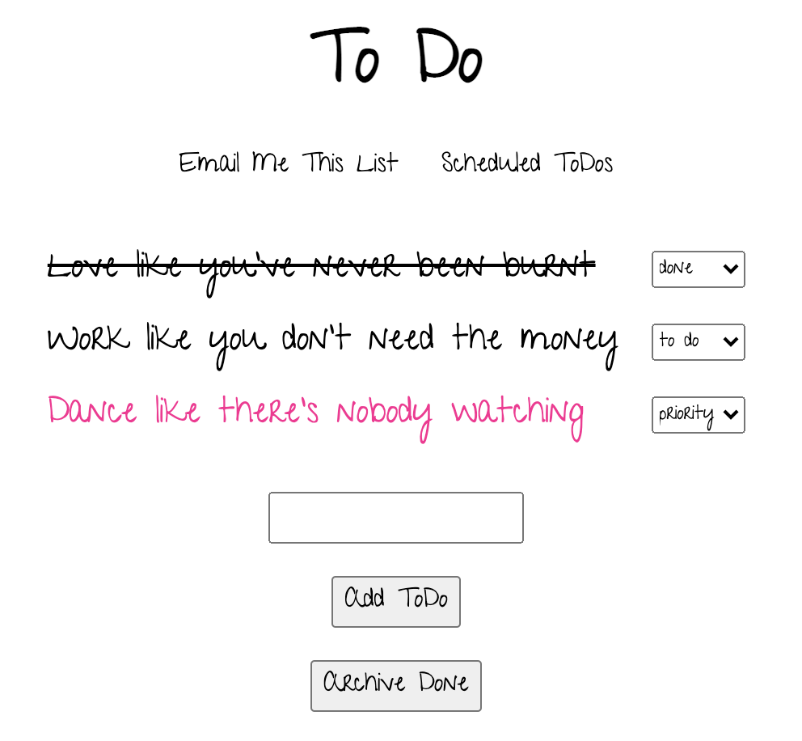

# ToDos

Lightweight lists app built using Rails and Stimulus.

## Running Locally

* Clone and `cd` into this repository.
* Run `bundle install`.
* Run `npm install`.
* Run `rails db:setup`.
* Run `rspec` to check that the tests are passing.
* Run `rubocop` to check that all the Ruby files are ship-shape.
* Run `npx eslint .` to check that all the JavaScript files are looking sharp.
* Run `bin/rails server` and go to `http://localhost:3000`.

## Live Version

Running on Heroku [here](https://whispering-beach-18521.herokuapp.com).
